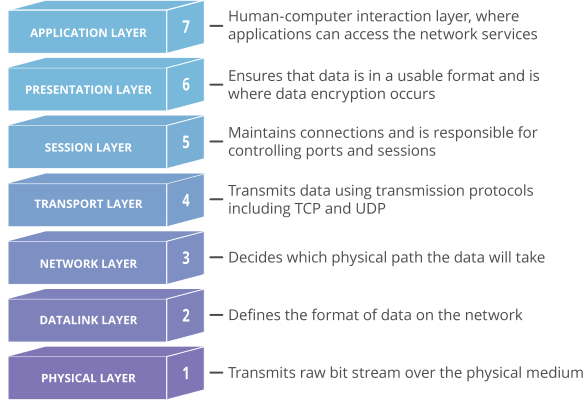

<strong>Figure:</strong> the OSI layers and their usage.

# OSI✈️
| **protocol**                        | **decode**                           | ***mind***                           |
| :---------------------------------- | :----------------------------------- | :----------------------------------- |
|🚀                                   |                                   🚀 |                                   🚀|   
| 🚀 ***`Физический (Physical)`*** 🚀 | 🚀 ***`Физический (Physical)`*** 🚀 | 🚀 ***`Физический (Physical)`*** 🚀 |
|1️⃣Ethernet      |(IEEE 802.3)                             |Стандарт проводной локальной сети, который определяет методы физической передачи данных.       
|                |                                         |                                                                                                                                       
|2️⃣Wi-Fi         |(IEEE 802.11)                            |Беспроводкой стандарт локальной сети, который обеспечивает передачу данных по радиоволнам.    
-WEP             |📌Wired Equivalent Privacy               |Устаревший протокол шифрования Wi-Fi, уязвим к взлому.                                        
-WPA/WPA2        |📌Wi-Fi Protected Access                 |Протоколы шифрования Wi-Fi, обеспечивающие более высокую безопасность.                        
-WPS             |📌Wi-Fi Protected Setup                  |Протокол для упрощенной настройки безопасности Wi-Fi, но может иметь уязвимости.              
|                |                                         |
3️⃣Bluetooth      |                                         |Беспроводной протокол для обмена данными между устройствами на коротких расстояниях.          
-BLE             |📌Bluetooth Low Energy                   |Энергоэффективная версия протокола Bluetooth для связи с низким энергопотреблением устройств. 
-BlueBorne       |📌BlueBorne                              |Уязвимость Bluetooth, позволяющая удаленное выполнение кода на устройствах.                   
|                |                                         |
4️⃣USB            |Universal Serial Bus                     |Протокол для подключения периферийных устройств к компьютеру.                                 
-USB HID         |📌Human Interface Device                 |Протокол для подключения устройств ввода-вывода, таких как клавиатура и мышь.                
|                |                                         |
|🚀                                    |                                   🚀 |                                   🚀|   
| 🚀 ***`Канальный (Data link)`*** 🚀  | 🚀 ***`Канальный (Data link)`*** 🚀  | 🚀 ***`Канальный (Data link)`*** 🚀 |
|1️⃣PPP           |Point-to-Point Protocol                  |Протокол для установки и управления соединением между сетевыми устройствами.
-PPPoE           |📌PPP over Ethernet                      |Протокол для передачи PPP-фреймов через Ethernet-соединение.
-PPTP            |📌Point-to-Point Tunneling Protocol      |Протокол для создания виртуальной частной сети (VPN) через обычное соединение.
-L2TP            |📌Layer 2 Tunneling Protocol             |Протокол для создания VPN, комбинирующий функции PPTP и L2F.
|                |                                         |
2️⃣HDLC           |High-Level Data Link Control             |Протокол для надежной передачи данных между сетевыми устройствами.
-PPP             |📌HDLC-based                             |Расширение протокола PPP, использующее HDLC-фреймы для передачи данных.
-LAPB            |📌Link Access Procedure, Balanced        |Протокол управления доступом к каналу передачи данных.
|                |                                         |
3️⃣Frame Relay    |Frame Relay                              |Протокол коммутации кадров, используемый для передачи данных между удаленными сетями.
|                |                                         |
4️⃣ATM            |Asynchronous Transfer Mode               |Протокол для передачи данных по высокоскоростным сетям, основанный на передаче ячеек.
|                |                                         |
|🚀                                   | 🚀                                    |                                🚀|   
| 🚀 ***`Сетевой (Network)`*** 🚀     | 🚀 ***`Сетевой (Network)`*** 🚀       | 🚀 ***`Сетевой (Network)`*** 🚀 |
1️⃣IP              |Internet Protocol                       |Протокол маршрутизации, отвечающий за адресацию и фрагментацию пакетов данных.
-IPv4             |📌Internet Protocol version 4           |Версия IP, использующая 32-битные адреса
-IPV6             |📌Internet Protocol version 6           |Версия IP, использующая 128-битные адреса и предназначенная для решения проблем исчерпания адресного пространства IPv4.
|                 |                                        |
2️⃣ICMP            |Internet Control Message Protocol       |Протокол для отправки сообщений об ошибках и управления сетью. 
-ping             |📌ICMP Echo Request/Reply               |Команда для проверки доступности удаленного узла.
|                 |                                        |
3️⃣IGMP            |Internet Group Management Protocol      |Протокол для управления группами IP-мультикаста. 
|                 |                                        |
4️⃣ARP             |Address Resolution Protocol             |Протокол для связывания IP-адресов с физическими адресами в сети Ethernet.
|                 |                                        |
|🚀 | 🚀 | 🚀|
| 🚀 ***`Транспортный (Transport)`*** 🚀 | 🚀 ***`Транспортный (Transport)`*** 🚀  | 🚀 ***`Транспортный (Transport)`*** 🚀 |
1️⃣TCP             |Transmission Control Protocol           |Надежный протокол для установки соединения и управления потоком данных. 
-TCP SYN flood    |📌TCP synchronize flood                 |Тип атаки на TCP, направленный на исчерпание ресурсов сервера с помощью отправки большого количества SYN-запросов.
-TCP RST Injection|📌TCP reset injection                   |Техника, при которой вредоносный активатор внедряет сброс (RST) пакеты в TCP-соединение, приводящие к разрыву соединения
|                 |                                        | 
2️⃣UDP             |User Datagram Protocol                  |Протокол для передачи данных без установления соединения.
-UDP Flood        |📌UDP Flood                             |Тип атаки на UDP, при которой злоумышленник отправляет большое количество UDP-пакетов для исчерпания ресурсов сервера.
|                 |                                        |
3️⃣SCTP            |Stream Control Transmission Protocol    |Протокол для надежной доставки пакетов данных с управлением потоком и множественными потоками данных.
|                 |                                        |
4️⃣DCCP            |Datagram Congestion Control Protocol    |Протокол для передачи данных с управлением заторов.
|                 |                                        |
|🚀 | 🚀 | 🚀|
| 🚀 ***`Сеансовый (Session)`*** 🚀 | 🚀 ***`Сеансовый (Session)`*** 🚀  | 🚀 ***`Сеансовый (Session)`*** 🚀 |
1️⃣SIP             |Session Initiation Protocol             |Протокол для установки и управления сеансами связи, особенно в голосовых и видеосвязях.
|                 |                                        |
2️⃣NBSS            |NetBIOS Session Service                 |Протокол для установления и управления сеансами между компьютерами. 
|                 |                                        |  
3️⃣ASP             |AppleTalk Session Protocol              |Протокол для установки и управления сеансами в сетях Apple.
|                 |                                        |
4️⃣RPC             |Remote Procedure Call                   |Протокол для удаленного вызова процедур на удаленных компьютерах.
|                 |                                        |
5️⃣ZIP             |Zone Information Protocol               |Протокол для обмена информацией о зонах в сети AppleTalk.
|                 |                                        |
|🚀 | 🚀 | 🚀|
| 🚀 ***`Представительный (Presentation)`*** 🚀 | 🚀 ***`Представительный (Presentation)`*** 🚀  | 🚀 ***`Представительный (Presentation)`*** 🚀 |
1️⃣HTTP            |Hypertext Transfer Protocol             |Протокол для передачи веб-страниц и взаимодействия с веб-серверами.
-HTTP GET/POST    |📌HTTP GET/POST                         |Основные методы запроса в протоколе HTTP
|                 |                                        |  
2️⃣FTP             |File Transfer Protocol                  |Протокол для передачи файлов между компьютерами
|                 |                                        | 
3️⃣SMTP            |Simple Mail Transfer Protocol           |Протокол для отправки электронной почты.
|                 |                                        |  
4️⃣DNS             |Domain Name System                      |Протокол для преобразования доменных имен в IP-адреса и наоборот.
|                 |                                        |
5️⃣SNMP            |Simple Network Management Protocol      |Протокол для управления и мониторинга сетевых устройств и систем.
|                 |                                        | 
6️⃣LDAP            |Lightweight Directory Access Protocol   |Протокол для доступа и управления данными в распределенных каталогах.
|                 |                                        |
7️⃣POP3            |Post Office Protocol version 3          |Протокол для получения электронной почты с почтового сервера.
|                 |                                        |
8️⃣IMAP            |Internet Message Access Protocol        |Протокол для получения и управления электронной почтой на удаленном сервере.
|                 |                                        |
9️⃣TELNET          |TELNET                                  |Протокол для удаленного доступа к компьютеру через сеть. 
|                 |                                        | 
1️⃣0️⃣SSH           |Secure Shell                            |Протокол для безопасного удаленного доступа к компьютеру и выполнения команд.
|                 |                                        |
1️⃣1️⃣NNTP          |Network News Transfer Protocol          |Протокол для распространения и обмена новостными сообщениями в Usenet.
|                  |                                        | 
